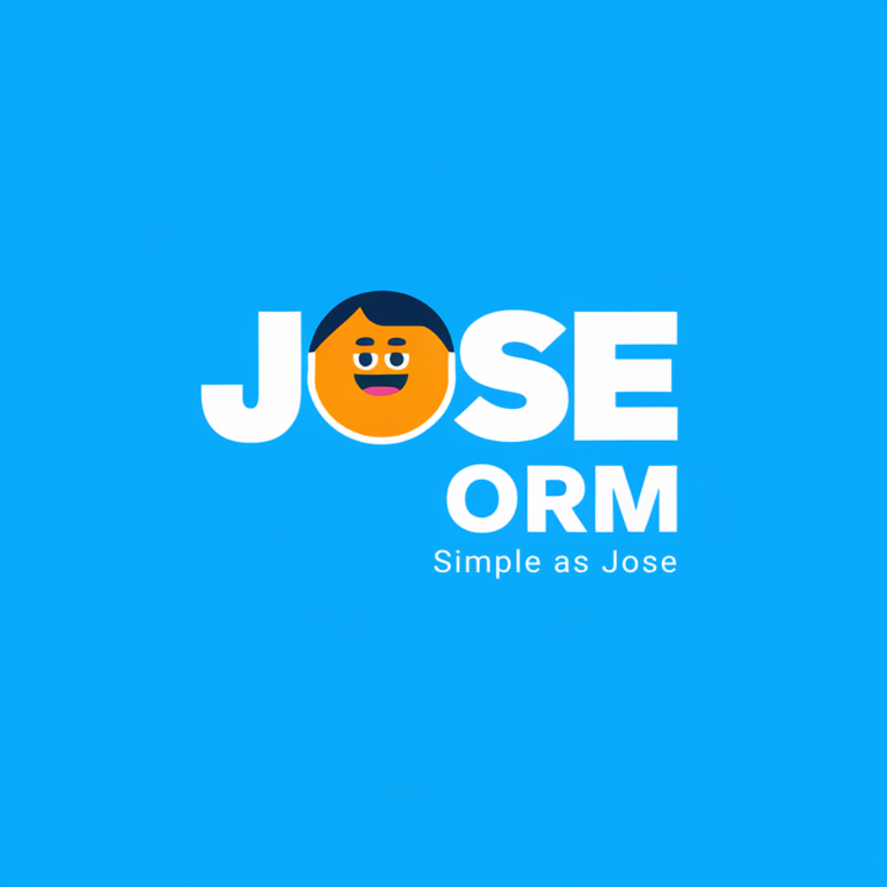

<p align="center">
  
</p>

# Jose ORM

Jose ORM é um poderoso ORM (Object-Relational Mapping) para localStorage com tipagem segura, agnóstico de framework que torna a persistência de dados nos navegadores simples e confiável.

> **Nota**: Este projeto está em desenvolvimento ativo e ainda não está pronto para uso em produção. Lembre-se de deixar um feedback ou abrir uma issue se encontrar problemas.

## Por que usar Jose ORM?

- 🔒 **Tipagem Segura**: Construído com TypeScript para total segurança de tipos
- 🚀 **Interface Simples**: API intuitiva e natural *- Simples como o José*
- 💾 **localStorage Simplificado**: Trate o localStorage como um banco de dados real
- 🔍 **Operações tipo Query**: Encontre, atualize e delete dados facilmente
- 🏃 **Zero Dependências**: Leve e rápido

## Instalação

```bash
npm install joseorm
```
## Início Rápido
```typescript
import Jose, {j} from 'joseorm'

// Defina seu tipo de modelo
interface User {
  id: string
  name: string
  email: string
  age: number
  isActive: boolean
}

// Crie um Schema para o seu modelo
const userSchema = j.table<User>('users', {
    id: j.string().primaryKey('cuid'),
    name: j.string(),
    email: j.string().unique(),
    age: j.number(),
    isActive: j.boolean(true)
})

// Inicialize o ORM
const db = new Jose.createClient({
    storage: 'localStorage'
})

// Crie um repository para o seu modelo
const userRepository = db.createRepository(userSchema)
```

***

## Recursos Avançados

**Consultando Dados**

```typescript
// Encontre por campo específico
const adultos = userRepository.findMany({
  age: {
    greaterThan: 17
  }
})

// Consultas complexas
const joaos = userRepository.findMany({
  name: {
    includes: 'João',
  },
  age: {
      greaterThan: 18
    }
})
```

**Operações em Lote**

```typescript
// Crie múltiplos usuários
const users = userRepository.createMany([
  {id: '1', name: 'João', email: 'joao@exemplo.com', age: 17},
  { id: '2', name: 'José', email: 'joao@exemplo.com', age: 30 },
  { id: '3', name: 'Maria', email: 'maria@exemplo.com', age: 25 }
])

// Delete múltiplos usuários
userRepository.delete({
  age: {
    greaterThan: 17
  }
})

userRepository.update({
  age: {
    greaterThan: 17
  }
},
{
  isActive: false
}
)

```

**Segurança de Tipos**
*`Jose ORM utiliza TypeScript para fornecer total segurança de tipos`*

```typescript
interface Product {
  id: string
  name: string
  price: number
}

const userRepository = db.createRepository<Product>(productSchema)

// TypeScript detectará este erro
userRepository.create({
  id: '1',
  name: 'Notebook',
  price: '999' // Erro de tipo: price deve ser um número
})
```


## Vantagens Sobre localStorage Puro

* Tipagem Segura: Detecte erros durante a compilação
Dados Estruturados: Mantenha consistência na estrutura dos dados
* Capacidade de Consulta: Filtre e pesquise dados facilmente
Experiência do Desenvolvedor: API limpa em vez de parsing manual de JSON
* Integridade dos Dados: Validação automática de dados
Contribuindo

**Contribuições são bem-vindas! Sinta-se à vontade para abrir issues e enviar pull requests.**

## Licença

Este projeto é licenciado sob a licença MIT. Consulte o arquivo [LICENSE](./LICENSE) para mais informações.
